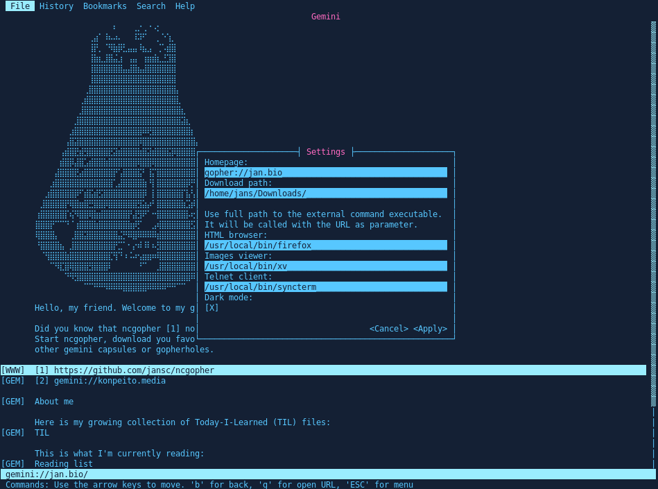

# ncgopher

`ncgopher` is a gopher and gemini client for the modern internet. It uses
ncurses and is written in Rust.

## gopher

Gopher was developed in 1991 at the University of Minnesota, and named
after the school's mascot. Gopher is a menu-driven interface that
allows a user to browse for text information served off of various
gopher servers.

## gemini

Gemini is a new application-level internet protocol for the distribution
of arbitrary files, with some special consideration for serving a
lightweight hypertext format which facilitates linking between files.

## Screenshot

Obligatory screenshot:

## Features

-   Gopher and gemini support
-   Ncurses interface
-   Keyboard commands for navigation
-   Bookmarks support including custom title
-   History of visited gopher holes
-   Download of text files and gophermaps (Save as&#x2026;)
-   Download of binary files
-   Menu for easy configuration
-   Mouse support in some terminals
-   TLS support
-   Darkmode!
-   Common search providers in search menu for quick access
-   External commands for HTML, images and Telnet

## Installation

### Arch Linux

Arch Linux users can install ncgopher using pacman:

    sudo pacman -S ncgopher

### NixOS

NixOS users can install ncgopher using nix-env:

    nix-env -iA nixos.ncgopher

### NetBSD

NetBSD users can install ncgopher using pkgin:

    pkgin install ncgopher

### All other systems

`ncgopher` has no fancy installation process right now. There are some external
dependencies which have to be installed. First and foremost you will of course
need to have Rust installed. Further dependencies are the *openssl*, *ncurses*
and *sqlite3* libraries. If these are not installed, the build will fail but
you will most likely be able to tell what is missing.

---
### Debian-based Linux

    sudo apt install build-essential pkg-config libssl-dev libncurses-dev libsqlite3-dev

### Arch-based Linux

    sudo pacman -S base-devel pkg-config openssl ncurses sqlite
---

If you know how to install the listed dependencies on your operating system and it is
not listed, please make a pull request to add it.

After installing these dependencies run

    cargo install ncgopher

To install the latest development version:

    git clone https://github.com/jansc/ncgopher.git
    cd ncgopher
    cargo build
    cargo run

## Key bindings

During alpha, the keybindings are not configurable and many operations
are still not implemented.

    |------------+--------------------------------|
    | Key        | Command                        |
    |------------+--------------------------------|
    | Arrow keys | Move around in text            |
    | Enter      | Open the link under the cursor |
    | Esc        | Go to menubar                  |
    | Space      | Scroll down one page           |
    | g          | Open new URL                   |
    | b          | Navigate back                  |
    | q          | Close application              |
    | s          | Save current page              |
    | r          | Reload current page            |
    | i          | Show link under cursor         |
    | a          | Add bookmark for current page  |
    | n          | Go to next link                |
    | p          | Go to previous link            |
    | j          | Move one line down             |
    | k          | Move one line up               |
    |------------+--------------------------------|

## Mouse support

`ncgopher` supports mouse interaction for menus and buttons in dialogs.
If you want to select text, most terminal support selection while 
pressing `SHIFT`.

## Debugging

The software is still in beta, and it is also my first application
written in Rust. Expect lots of bugs and badly written Rust code.

If the application crashes, I'd be interested in a log file.
To produce one, please rerun the program with the command line flag `-d` and a
file name to store the log in, for example "error.log".
It should look something like this: `ncgopher -d error.log`
This will append log messages to `error.log` (the file will be created if it
does not exist).
With this, try to reproduce the bug and take note of the backtrace output.

If you know how to do that and you installed the source, you can run the
program with `RUST_BACKTRACE` to get a backtrace too.

## License

`ncgopher` is licensed under the BSD 2-clause license.

Copyright (c) 2019-2021 The ncgopher Authors. Parts of the
status bar implementation are Copyright (c) 2019, Henrik Friedrichsen
